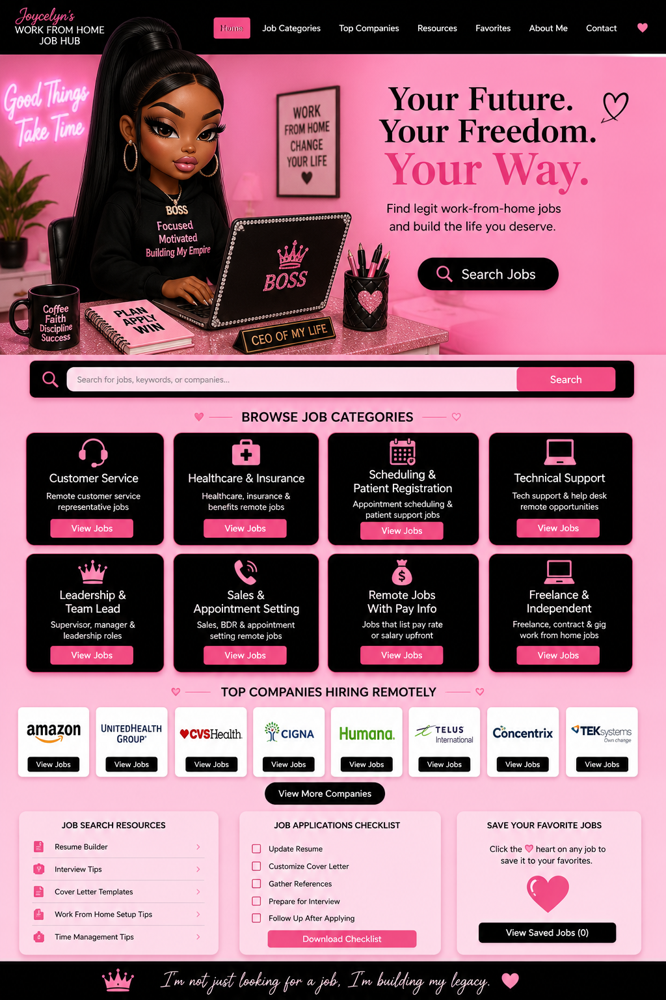

# WFH-JOB-hub

<!DOCTYPE html>
<html lang="en">
<head>
  <meta charset="UTF-8">
  <meta name="viewport" content="width=device-width, initial-scale=1.0">
  <title>Joycelyn's Work From Home Job Hub</title>
  
</head>
<body>

  <!-- Your Job Hub Image -->
  

  <!-- Clickable Button Areas (You can update these href links anytime!) -->
  <map name="jobhub-map">
    <!-- Customer Service 'View Jobs' Button -->
    <area shape="rect" coords="75,520,200,540" href="YOUR_CUSTOMER_SERVICE_LINK_HERE" alt="Customer Service Jobs" target="_blank">
    
    <!-- Healthcare 'View Jobs' Button -->
    <area shape="rect" coords="300,520,430,540" href="YOUR_HEALTHCARE_LINK_HERE" alt="Healthcare Jobs" target="_blank">
  </map>

</body>
</html>
